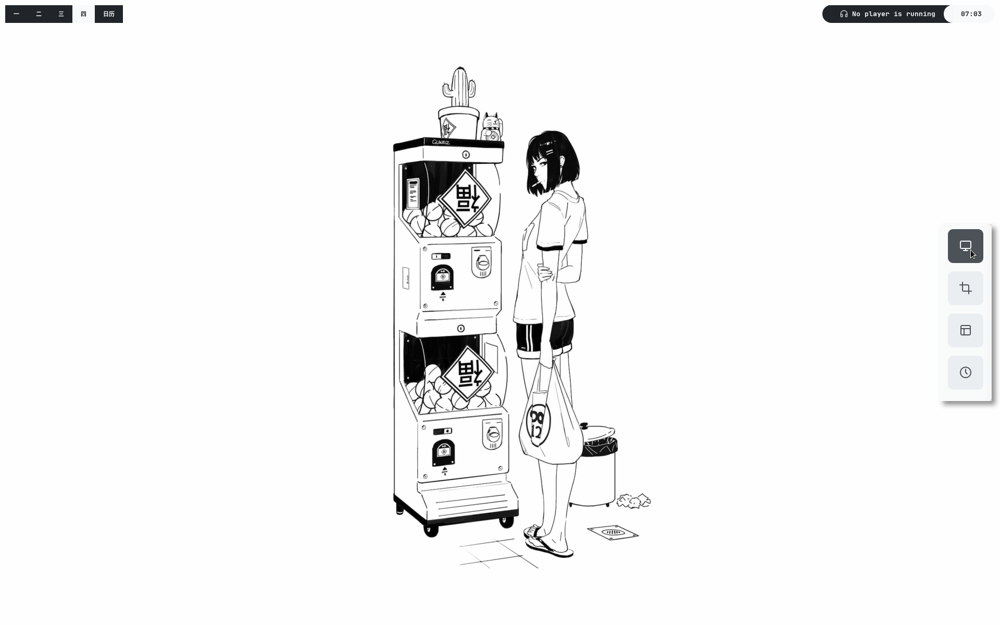

# 菜 rice is life 菜

My personal dotfiles! I stole a lot of it from other people and modified it ^^

## specs
- OS: **Solus**
- wm: **i3**
- bar: **polybar**
- terminal: **Kitty** with ohmybash
- editor: **doom-emacs**
- notifications: **dunst**
- compositor: **picom**
- web browser: **qutebrowser**
- file browser: **ranger or nautilus**
- pdf-viewer: **zathura**
- font: **JetBrainsMono NF**
- colorscheme: **open-color**

## ToDo
- [ ] clean up stitched config files
- [ ] upload .Xresources
  - [ ] find way to generate config files with xresource colors
- [ ] upload screenshot(s)
- [ ] fix screenshot widget appearing in screenshot
- [ ] change accent color
- [ ] fix terminal color scheme
